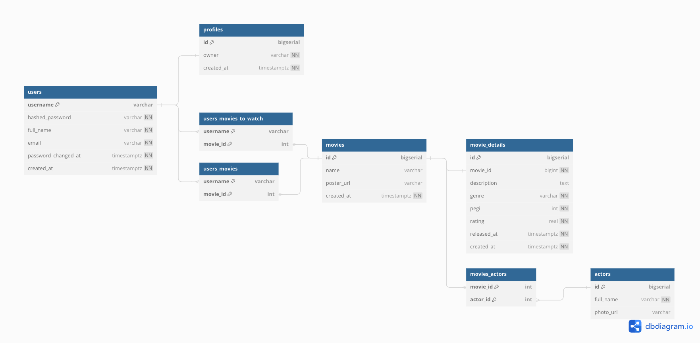

# Film API

Film API is an educational project to get hands on backend development in Kotlin
with [Ktor](https://ktor.io/) web framework and [Exposed](https://jetbrains.github.io/Exposed/home.html) database library.

## API

*TODO: Add description of the API endpoints implementation.*

## Database

The project uses [H2 Database](https://www.h2database.com/) to store data in a file.

H2 Database is an embedded SQL database that is feature-rich, performant, and
lightweight what makes it a good reasonable choice for our backend project to
start with and scale as it grows.

## Database Schema

You can view the DBML source code of the schema [here](https://dbdiagram.io/d/Film-API-66042011ae072629ce197d7a).

`Users` table is intended for user accounts that are unique and serve for
authentication and authorization.
Without a `User` entity (that is user account) a consumer of the API (either a
user themselves or a mobile app for example) cannot interact with the API and
perform actions and operations.

`Profiles` table is intended for user representations that are not unique
by themselves and serve for profile information.
Without an `Profile` entity (that is user profile) a consumer of the API cannot
interact with the API too because every consumer (`User`) has to have a profile
(`Profile`).
`Users` and `Profiles` tables have a one-to-one relationship.
